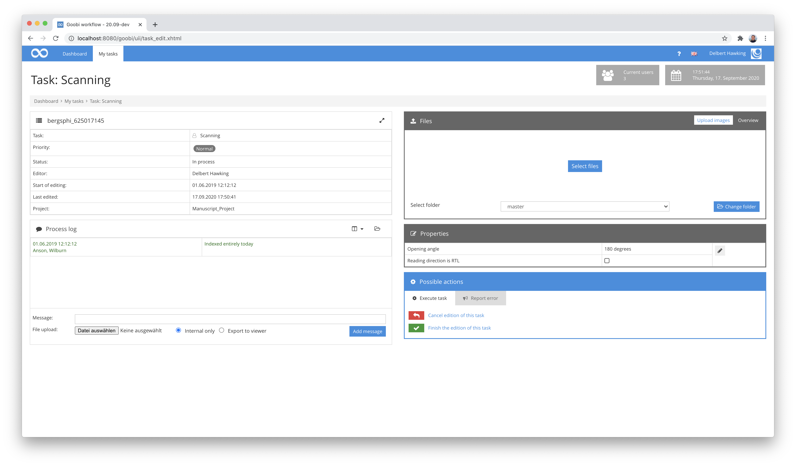
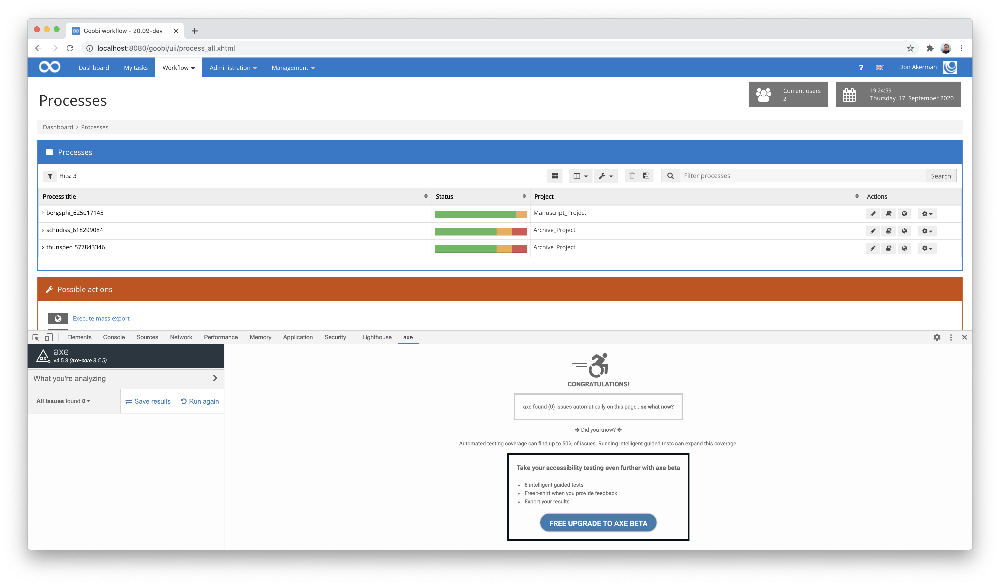

# July 2020

## Coming soon

In the coming weeks we will probably focus on the following points:

* Completion of WCAG compatibility
* Revision of the process creation page to use the data of the respective ruleset
* Extension of queuing functionalities by means of Active MQ
* Implementation of various generic plugins for different workflows

## Extensive vocabularies with paginated list of records

After we transferred the vocabulary manager to the core of Goobi workflow a few months ago, it was quickly used for several projects to have controlled vocabularies within the METS editor as a drop-down list or to run special plugins and exports that homogenise different spellings. What was noticeable was that the handling was not yet optimal, especially when it came to extensive vocabularies as they can be imported via an Excel import.


The vocabulary entries are from now on displayed with a paginator. This not only allows a significantly shorter loading time than before, but also prevents unnecessary scrolling of the website when switching between different data sets.

[https://github.com/intranda/goobi-workflow/commit/241ef334ac0237dfc1195d3bfc64fdf4acc9b576](https://github.com/intranda/goobi-workflow/commit/241ef334ac0237dfc1195d3bfc64fdf4acc9b576)  
 [https://github.com/intranda/goobi-workflow/commit/904df6556feea3eb1a0fb9780e09e15af9911d19](https://github.com/intranda/goobi-workflow/commit/904df6556feea3eb1a0fb9780e09e15af9911d19)  
 [https://github.com/intranda/goobi-workflow/commit/c31869eb31cd22a79630c4d429a59408eefbecf6](https://github.com/intranda/goobi-workflow/commit/c31869eb31cd22a79630c4d429a59408eefbecf6)

## Flexible folder names within the FileUpload plugin

Last month, we reported on an extension to Goobi workflow that now allows users to have Goobi manage different folders with their own naming scheme. We have now also extended the file upload plugin to allow users to use this functionality in other places. It can now not only handle these new configurable folders. It now also allows for the user to upload files to more than one folder for individual tasks.



The configuration for such a use case within the file `plugin_intranda_step_fileUpload.xml` would look like this as an example:

```markup
<config_plugin>

    <config>
        <!-- which projects to use for (can be more than one, otherwise use *) -->
    <project>*</project>
        <step>*</step>
        <!-- which file types to allow -->
        <regex>/(\.|\/)(gif|jpe?g|png|tiff?|jp2|pdf)$/</regex>
        <!-- which folder to use (master or media) -->
    <folder>master</folder>
        <folder>media</folder>
    </config>

</config_plugin>
```

[https://github.com/intranda/goobi-plugin-step-fileupload/commit/3dcc5ba4930501a378920703a309e7573f79cf6b](https://github.com/intranda/goobi-plugin-step-fileupload/commit/3dcc5ba4930501a378920703a309e7573f79cf6b)  
 [https://github.com/intranda/goobi-plugin-step-fileupload/commit/0b2caa7105b15f4f3fe05d2bcfa7bf9feb4a007d](https://github.com/intranda/goobi-plugin-step-fileupload/commit/0b2caa7105b15f4f3fe05d2bcfa7bf9feb4a007d)  
 [https://github.com/intranda/goobi-plugin-step-fileupload/commit/12a803c02fd8e24e00609237d96725588393581a](https://github.com/intranda/goobi-plugin-step-fileupload/commit/12a803c02fd8e24e00609237d96725588393581a)

## Flexible folder names within the ImageQA plugin

After an extension of the FileUpload plugin, we have also extended the Image QA plugin in a similar way for the use of different folders. Now it is possible for a user to perform quality control of images within different folders of a process. Depending on which directories have been allowed in his task, the user can switch between the different folders and view the objects contained therein.


To determine which directories should be accessible to a user in which task, a configuration is made, for example, in the file `plugin_intranda_step_imageQA.xml`:

```markup
    ...
    <config>
        <project>*</project>
        <step>ImageQA</step>
        <foldername>master</foldername>
        <foldername>media</foldername>
        <!-- how to display the thumbnails -->
        <numberOfImagesPerPage>12</numberOfImagesPerPage>
        <thumbnailsize>200</thumbnailsize>
        <!-- which image sizes to use for the big image -->
        <imagesize>800</imagesize>
        <imagesize>3000</imagesize>
        <!-- show OCR text beside image -->
        <displayocr>true</displayocr>
    </config>
    ...
```

[https://github.com/intranda/goobi-plugin-step-imageqa/commit/9b99a3180b16f83b495062102a033068b5fd994d](https://github.com/intranda/goobi-plugin-step-imageqa/commit/9b99a3180b16f83b495062102a033068b5fd994d) [https://github.com/intranda/goobi-plugin-step-imageqa/commit/b444f75e681a284fddf0c3b73511b6da4a5f01d6](https://github.com/intranda/goobi-plugin-step-imageqa/commit/b444f75e681a284fddf0c3b73511b6da4a5f01d6) [https://github.com/intranda/goobi-plugin-step-imageqa/commit/9b99a3180b16f83b495062102a033068b5fd994d](https://github.com/intranda/goobi-plugin-step-imageqa/commit/9b99a3180b16f83b495062102a033068b5fd994d)

## Flexible folder names within the JHove validation plugin

In order to allow different validation of different image folders for a project, the plugin for image validation based on JHove had to be revised. So it is now also possible to control in this plugin which folder should be validated exactly how, which also applies to the flexible individually configured directories. The configuration for this looks within the configuration file `plugin_intranda_step_tif_validation.xml` exemplarily as follows:

```markup
<config_plugin>
  <config>
      <project>*</project>
      <step>Validate Scans</step>
      <!-- folders to validate, can be multiple one (e.g. master, main etc. -->
      <folder>scans</folder>
      <openStepOnError>Scanning</openStepOnError>
      <lockAllStepsBetween>true</lockAllStepsBetween>
      <jhoveConfiguration>/opt/digiverso/goobi/config/jhove/jhove.conf</jhoveConfiguration>
      <namespace uri="http://www.loc.gov/mix/v20" name="mix" />
      <namespace uri="http://hul.harvard.edu/ois/xml/ns/jhove" name="jhove" />
      <!--Check color depth -->
      <check>
          <xpath>string(//mix:bitsPerSampleValue[1])</xpath>
          <wanted>8</wanted>
          <error_message> Check color depth for "${image}": Expected value "${wanted}", but found value "${found}".</error_message>
      </check>
  </config>
  <config>
        <project>*</project>
        <step>Validate Photographs</step>
        <!-- folders to validate, can be multiple one (e.g. master, main etc. -->
        <folder>photographs</folder>
        <openStepOnError>Scanning</openStepOnError>
        <lockAllStepsBetween>true</lockAllStepsBetween>
        <jhoveConfiguration>/opt/digiverso/goobi/config/jhove/jhove.conf</jhoveConfiguration>
        <namespace uri="http://www.loc.gov/mix/v20" name="mix" />
        <namespace uri="http://hul.harvard.edu/ois/xml/ns/jhove" name="jhove" />
        <!--Check color depth -->
        <check>
            <xpath>string(//mix:bitsPerSampleValue[1])</xpath>
            <wanted>16</wanted>
            <error_message> Check color depth for "${image}": Expected value "${wanted}", but found value "${found}".</error_message>
        </check>
    </config>
</config_plugin>
```

## Accessibility according to WCAG 2.1

The Web Content Accessibility Guidelines \(WCAG\) as an international standard for the accessible design of web pages are binding within the European Union for public bodies from 23 September 2019 for new and from 23 September 2020 also for existing websites according to WCAG 2.1 Level AA. In order to comply with these requirements, we are thoroughly revising the user interface of Goobi workflow. We were able to complete most areas in July. The very time consuming work will still move on, especially for the METS editor and the numerous plugins to be considered. However, we are delighted that we can now already fulfil the first accessibility validators.



[https://github.com/intranda/goobi-workflow/commit/ed0e76c20334ff318d8e856927c6f3359a322c77](https://github.com/intranda/goobi-workflow/commit/ed0e76c20334ff318d8e856927c6f3359a322c77)  
 [https://github.com/intranda/goobi-workflow/commit/e7c49f18cd4bba9bb299ec5f3f70034a92d5918f](https://github.com/intranda/goobi-workflow/commit/e7c49f18cd4bba9bb299ec5f3f70034a92d5918f)  
 [https://github.com/intranda/goobi-workflow/commit/e7c49f18cd4bba9bb299ec5f3f70034a92d5918f](https://github.com/intranda/goobi-workflow/commit/e7c49f18cd4bba9bb299ec5f3f70034a92d5918f)

## LayoutWizzard Workflow Plugin

Within a project, the requirement arose that automatic cropping by means of LayoutWizzard should not only be possible for entire processes. In particular, it was necessary to ensure that only one or two images were available in a process at any one time and that it should therefore be possible to process the images across processes. For this reason we implemented an extension for the LayoutWizzard that works as a workflow plugin. There it is possible to get images listed from several processes in order to crop them. In the list of images listed there, only those images from processes are shown that have already passed through a configured workflow step \(e.g. a completed image analysis\).


Documentation for this new plugin can be found at the following URL:



## Further adjustments

In addition to the major developments, there were again some other adjustments:

### Updates of many dependencies in Goobi workflow

Like all major software, Goobi workflow uses numerous external programme libraries provided by other developers under an open source licence. We've tidied up a lot and updated many such libraries to keep them up to date. At first glance, a change of this kind hardly has any effect on the user interface. In the medium term, however, this will of course allow many additional extensions to the range of functions.

[https://github.com/intranda/goobi-workflow/commit/ad712cdd5509fd478c8753ef6c112a389cb41e9e](https://github.com/intranda/goobi-workflow/commit/ad712cdd5509fd478c8753ef6c112a389cb41e9e)

### Goobi workflow on S3: fix for transferring files larger than 5GB

Hardly any institution has yet taken advantage of the possibility of running Goobi workflow in the Amazon cloud under S3. However, for those who do, there is an adjustment for uploading large files. It is now also possible to work with files larger than 5 GB.

[https://github.com/intranda/goobi-workflow/commit/2a384950ce45cd23fd1f082ef4f460d65995f091](https://github.com/intranda/goobi-workflow/commit/2a384950ce45cd23fd1f082ef4f460d65995f091)

### Fixing small JavaScript errors

During our regular clean-up work on the source code of the software some minor JavaScript bugs were found and fixed. This mainly concerns small discrepancies within the display in the user interface.

[https://github.com/intranda/goobi-workflow/commit/4fd6f8a69755fa9568e5c0eac458d62bb28a63f8](https://github.com/intranda/goobi-workflow/commit/4fd6f8a69755fa9568e5c0eac458d62bb28a63f8)

### Internal infrastructure adaptations

In order to keep all the relevant plugins up to date, even when a new version of Goobi workflow is released every month, we have once again significantly revised our internal infrastructure based on Jenkins and Nexus. This enables us to ensure that our plug-ins are automatically compatible with the latest version of Goobi. As a result of this work, updates to Goobi systems are now much easier.
