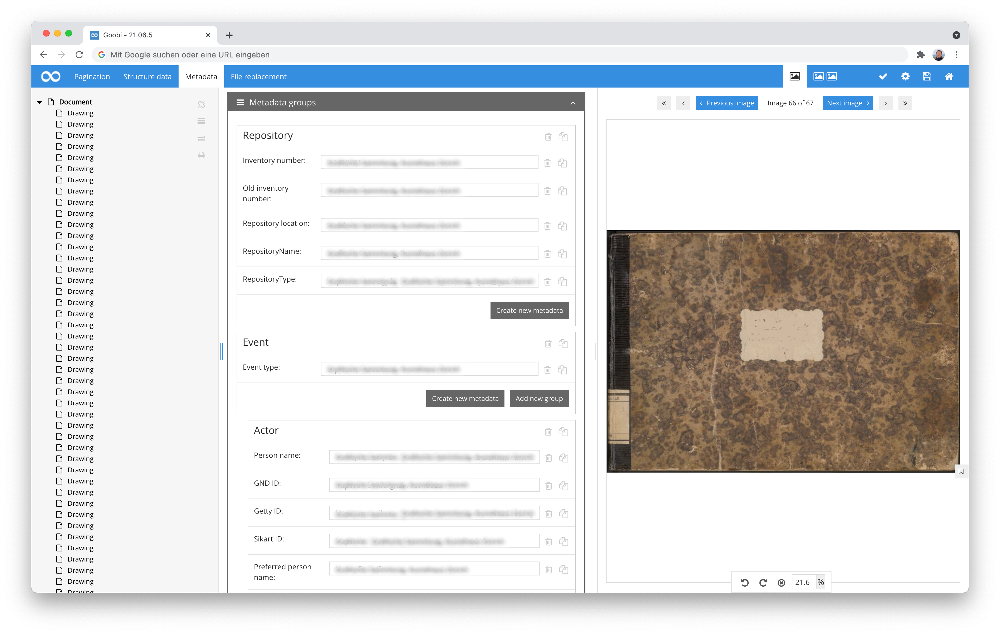
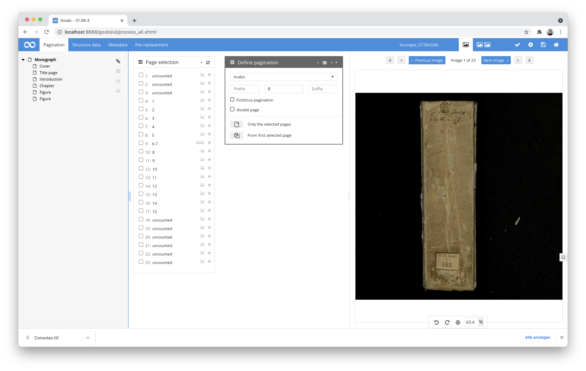
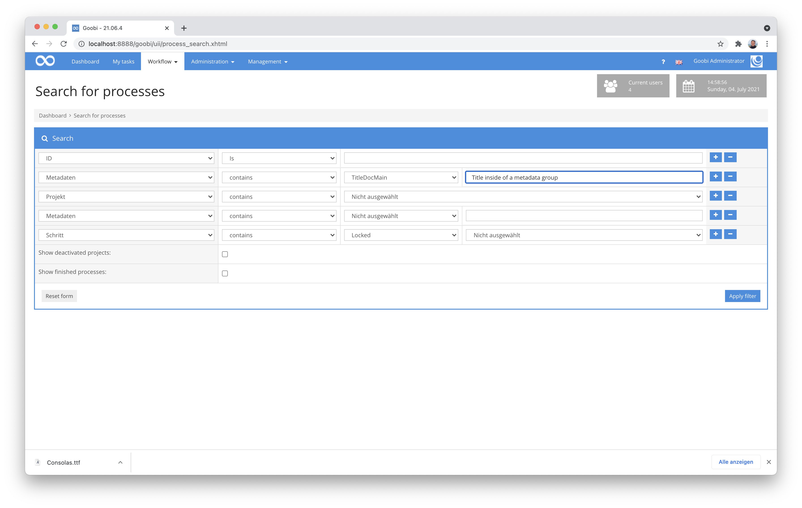
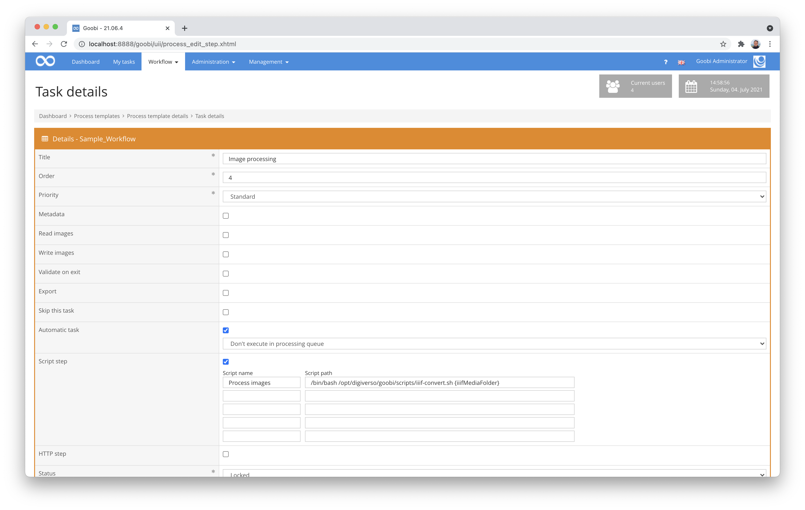
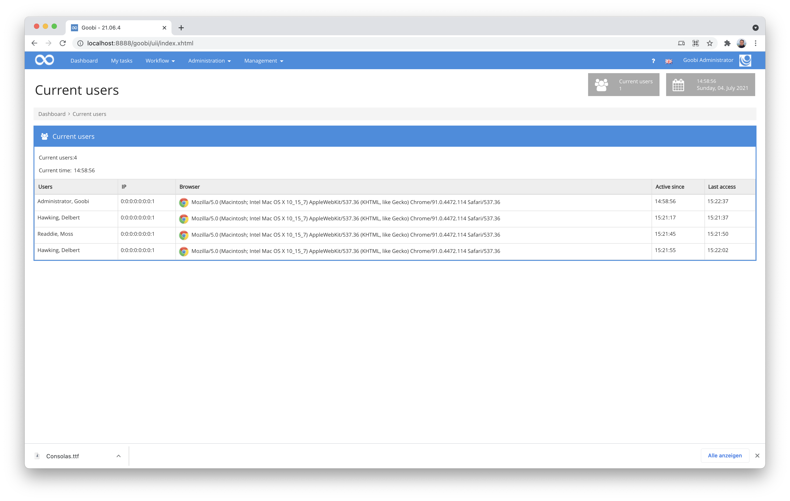
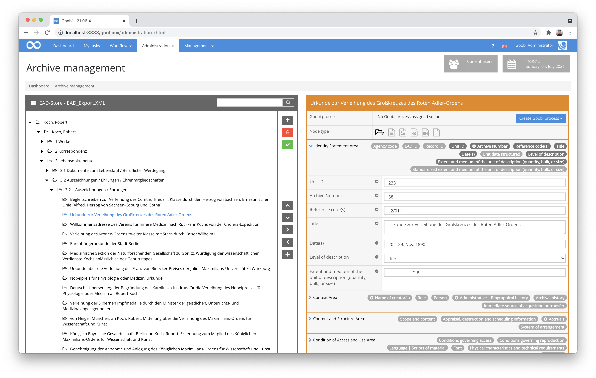

# April 2021

## Coming soon

- Implementation of an ALTO editor for editing full texts
- Extensions to the dashboard
- Adaptations to the caching

## Major restructuring of metadata groups

The metadata editor now allows metadata groups to be created within other metadata groups. This is of particular interest for museum content, for example, to be able to correctly map data from the LIDO format. To implement this functionality, the metadata library ugh has been massively extended and the metadata editor in Goobi has also received a few lines of new code. In addition to groups within groups, repeatable fields, mandatory fields, duplicating or deleting individual fields or subgroups and the evaluation of the `DefaultDisplay="true"` directive within groups are now supported.



https://github.com/intranda/goobi-workflow/commit/a357beb2d4d1c4f9dc47d40d1649fe03ec3259d3

## Further accessibility adaptations

Unfortunately, the major issue of accessibility is still with us. But if you want it to be good, you have to have stamina. So this month we have again made many small, inconspicuous but sensible adjustments. First and foremost, it was once again a matter of converting other previous links to buttons.

By the way, here are some exciting links on the subject of buttons vs. links:

https://a11y-101.com/design/button-vs-link<br/>
https://naga.co.za/2020/03/13/links-vs-buttons/<br/>
https://www.w3.org/WAI/fundamentals/accessibility-intro/


https://github.com/intranda/goobi-workflow/commit/d7242e22d03db5339fd74fcc1a3345ad8e9cd26d<br/>https://github.com/intranda/goobi-workflow/commit/656955f364f78b3a992641688551bf9a20b07688<br/>https://github.com/intranda/goobi-workflow/commit/d6c3ccd093a1a21cf5e1d97bd86f0f4560f5b0a8<br/>https://github.com/intranda/goobi-workflow/commit/9c2530fd47a25d847237e9ea48f0fd6bfaf47228<br/>https://github.com/intranda/goobi-workflow/commit/1531b91f61b5e5c18c32108b2f76be456717c72d

## New pagination type for double pages

For a Swiss project, it was necessary for Goobi workflow and Goobi viewer to better handle digitised works that are already available as double pages. The particular difficulty was that such double pages should only be present in isolated cases within digitised works, but the page-turning logic within the viewer is then not affected by this and allows a double-page display for single pages just as seamlessly as it does a correct display of the individual double page.



In the metadata editor of Goobi workflow it is now possible to mark double pages as such. On the one hand, this concerns the marking of the page in order to classify it correctly within the METS files. On the other hand, the pagination options have also been extended so that there are now options for double page counting.


In the final result of such a generated METS file, the information captured in this way is correctly labelled and can be traced there. The Goobi viewer can then deal with it accordingly and allow the image to be displayed correctly for this purpose.

https://github.com/intranda/goobi-workflow/commit/18f445d1ae737488fac4dac66230c630e284326e

## Extension of the search options for metadata groups

After we have recently reimplemented some of the processing of metadata groups, we noticed that the previous search for metadata groups was not yet possible to the desired extent. Therefore, we have now extended the indexing of metadata to include those of metadata groups.



This can be illustrated quite well using a concrete example. For example, a metadata group is configured in the rule set as follows:

```xml
<Group>
      <Name>Title</Name>
      <language name="de">Titel</language>
      <language name="en">Title</language>
      <metadata num="1o">NonSort</metadata>
      <metadata num="1m">SortingTitle</metadata>
      <metadata num="*">Subtitle</metadata>      
</Group>
```

This could then be filled with such information within a concrete process:

Metadata | Value
------------|-----------
`NonSort`| The
`SortingTitle`| Art of War
`Subtitle`| The Ancient Classic

A search query like this can now be used to search for one of these fields:

```
"meta:SortingTitle:Art of War"
```

## IIIF URLs for scripts and other places

You have probably heard about the increasing use of IIIF. We already use it a lot, especially in the context of Goobi viewer. Recently, however, it became apparent that we could benefit from this even more in the context of Goobi workflow. We have therefore extended the so-called VariableReplacer so that, in addition to common variables such as the process ID, metadata from the METS file and directory paths, it can now also generate the associated image files of a process as IIIF image URLs. This is practical if, for example, an external application or a script is to have access to all image files of a process in order to carry out processing on the basis of them.

This is used in the same way as other variables, e.g. in calling scripts:



The following two variables are available:

Variable | Explanation
------------|-----------
`iiifMediaFolder`   | Listing of IIIF URLs to all images from the `media` directory of a process
`iiifMasterFolder`  | Listing of IIIF URLs to all images from the `master` directory of a process

The return of such a variable looks, for example, as follows:

```
"http://example.com/goobi/api/process/image/12345/schudiss_618299084_master/00000001.tif/full/max/0/default.jpg?jwt=1234567890", "http://example.com/goobi/api/process/image/12345/schudiss_618299084_master/00000002.tif/full/max/0/default.jpg?jwt=0987654321","http://example.com/goobi/api/process/image/12345/schudiss_618299084_master/00000003.tif/full/max/0/default.jpg?jwt=0987654321","http://example.com/goobi/api/process/image/12345/schudiss_618299084_master/00000004.tif/full/max/0/default.jpg?jwt=0987654321","http://example.com/goobi/api/process/image/12345/schudiss_618299084_master/00000005.tif/full/max/0/default.jpg?jwt=0987654321", ...
```

More information on the use of the VariableReplacer can be found in the Goobi manual at the following address:



https://github.com/intranda/goobi-workflow/commit/6f60ac60ebf9147f420098b59fc42e3da0b96bae<br/>https://github.com/intranda/goobi-workflow/commit/dd70cadea20ca37d9dbdb5f3414b1f759b1a53a8<br/>https://github.com/intranda/goobi-workflow/commit/b5ca950168a7388f5a39e62ab1072804f8e7f940

## Revision of the display of active users

When displaying active users within the Goobi workflow user interface, users were occasionally listed whose session had already expired or who were still displayed for other reasons. This was particularly annoying when we wanted to maintain the systems and take into account the supposedly active users. On closer analysis, we found a Goobi error here, which we were ultimately able to rectify. This means that ghost users are now a thing of the past.



https://github.com/intranda/goobi-workflow/commit/2e12a163f4e2c08b504e2702ac0b69b6cf612d95<br/>https://github.com/intranda/goobi-workflow/commit/4a0045ba1003a6567e1669bf1cb30cc0fe6dc2fd<br/>https://github.com/intranda/goobi-workflow/commit/b747d0e1507cdb0df52ddc8e08c233c231637004

## Mass import of data with enrichment of archive tectonics

For an institution in Luxembourg, we were required to automatically import a large dataset of files into Goobi, while also enriching the existing dataset that was in an EAD file.



The plugin we have developed for this purpose is still very much tailored to the specific use case of the institution and thus not yet directly applicable for other use cases without adaptations. However, if there is interest in such imports, we can develop this plugin further and make it generic. In the next few weeks we will publish and document this plugin together with many other plugins. Until then, please let us know if you are already interested in the plugin.

## New plugin for DOI registration

After having recently developed a plugin that enables handle registration with the EPIC service of the GWDG, we have now created another similar plugin. This is now the possibility to register works with Datacite in order to receive DOIs for them. It should be noted that DOIs are always assigned for publications, not for structural elements or even pages. With the extensions that will be made to the Goobi viewer in the near future, however, granular URLs, for example for pages, can also be made possible there on the basis of so-called web fragments.


The source code of the plugin has been published here on GitHub:



The detailed documentation on installation, configuration and operation can be found at the following address:



## Various internal adjustments

Internally, there was some major work this month, which is visually less noticeable and may seem less important to most users. In terms of content, however, such work is necessary from time to time in order to stay up-to-date with established software and to adapt to technological developments in order to remain compatible in the future. This month, therefore, some of the established programme libraries for processing XML files have been updated and tested. This mainly concerns libraries such as saxon, poi, xerces, xmlbeans and jaxb. In the best case, this results in the user not noticing any change and everything continues to work as usual.

By the way, another interve change we made also concerns the use of so-called session storage variables. There, both Goobi workflow and Goobi viewer had inadvertently chosen the same name. As a result, the scroll state was the same across both applications and some users were surprised to find that the metadata editor scrolled unexpectedly and as if by magic, because they had previously scrolled in the Goobi viewer. We have fixed this unusual error with the update.

https://github.com/intranda/goobi-workflow/commit/ba50c49627f3954589160eb15441afcf16f3f6e8<br/>https://github.com/intranda/goobi-workflow/commit/c48e1a8b3022074c65fa3868289196a8f24806f6<br/>https://github.com/intranda/goobi-workflow/commit/8cae3268d8ad90b9a0452b183f2746045c966600

